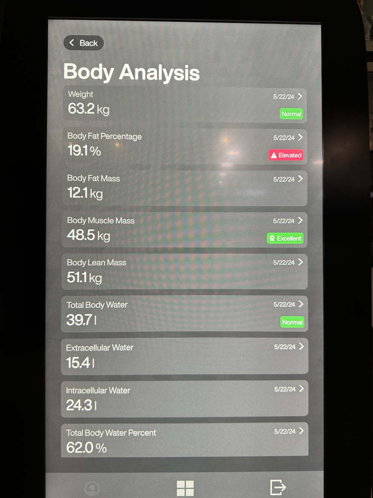
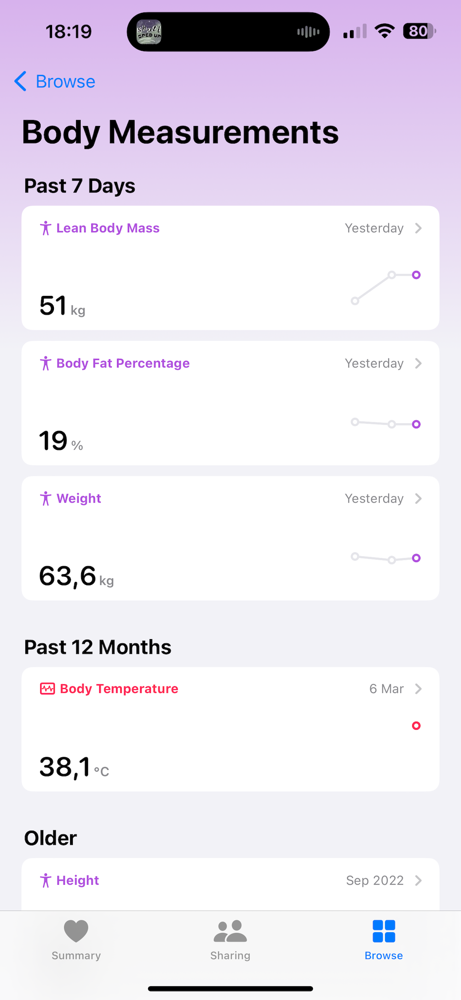

# EgymFitnessHub2Health

[Egym Fitness Hub](https://egym.com/us/workouts/fitness-hub) measures your fitness level with metrics like body fat, muscle mass, and more. This shortcut automates the process of entering your fitness data into the Health app.

<video src="https://github.com/cinaq/apple-shortcuts/raw/main/EgymFitnessHub2Health/demo.mp4"></video>

## Usage

- Login to Egym Fitness Hub
- Measure your fitness metrics
- Take a photo of the measurements with one of the shortcuts. We advice to use the Camera version:

- Observe the measurements in the health app:

The EgymFromPhoto shortcut is meant to load in existing measurements from a photo. Useful when you don't have your phone with you. The EgymFromCamera shortcut is meant to take a photo of the measurements.

## Latest iCloud Links

- EGym2Health: https://www.icloud.com/shortcuts/37cb830094bf497b9d576391d0ac92aa
- EgymFromCamera: https://www.icloud.com/shortcuts/81cac5beb4d744f384277145eaffff54
- EgymFromPhoto: https://www.icloud.com/shortcuts/6161d641b46548ea9d8e9b328fb3fd4d
- CalculateBMI: https://www.icloud.com/shortcuts/1b36ffea82c44450b7b588d518ae242f
