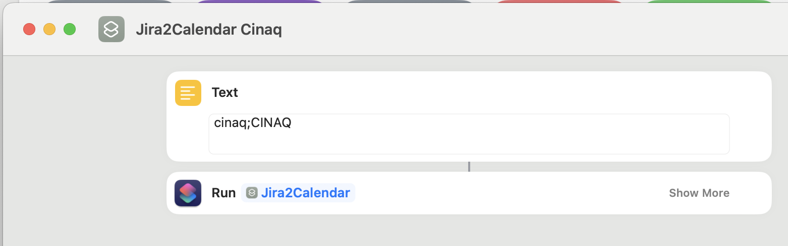

# Jira2Calendar

When the deadline attribute is set in a Jira issue, the issue is added to a Calendar. The calendar event is created if it does not exist.

Call `Jira2Calendar` with the format: `JiraCloudName;CalendarName`. JiraCloudName is used to construct the URL to jira issues in the calendar event.

## Latest iCloud Links

- Jira2Calendar: https://www.icloud.com/shortcuts/1f42d0ea6227486396aedde0f62b42e7
- Jira2Calendar-Usage-Example: https://www.icloud.com/shortcuts/da546ed2acb64d5d8398ed96b89b20b7